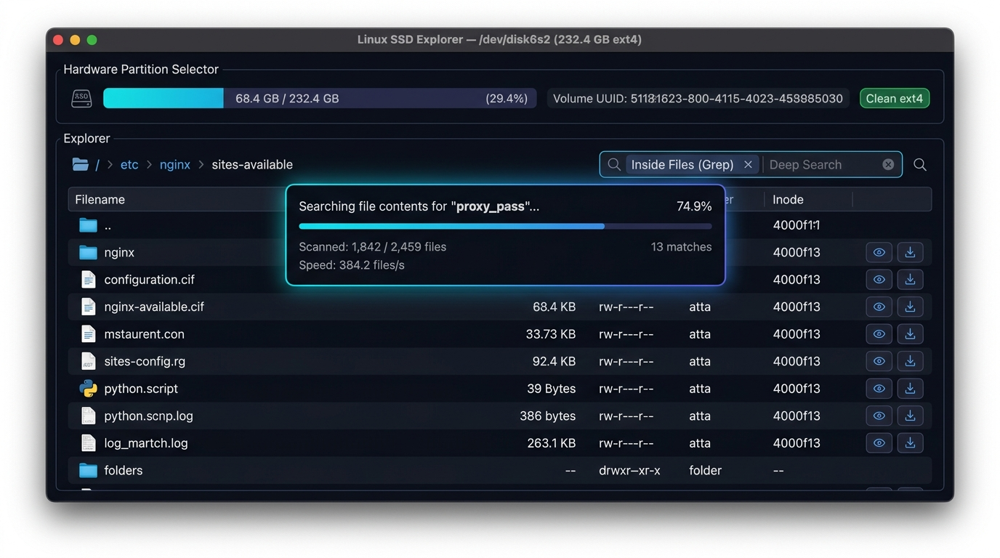

<div align="center">

# 🐧 MacExt4 / LinuxSSDReader
### The Free, Open-Source Alternative to Paragon extFS for Mac

**Read, browse, search, and extract files from Linux ext4, ext3, and ext2 SSDs, HDDs, and SD cards on macOS — 100% Free, Safe, and Kernel Extension-Free.**

[%20%26%20Intel-black?style=for-the-badge&logo=apple)](https://github.com)
[](https://github.com)
[](LICENSE)
[](https://github.com)
[-amber?style=for-the-badge)](https://github.com)

<br/>

[Features](#-key-features) • [Why Not Paragon?](#-why-choose-macext4-over-paragon-extfs) • [Quick Start](#-quick-start) • [Ways to Use](#-ways-to-use) • [Search & Grep Engine](#-real-time-streaming-search--grep) • [FAQ](#-frequently-asked-questions)

<br/><br/>



</div>

---

## 🚀 Why Choose MacExt4 Over Paragon extFS for Mac?

Apple's macOS cannot natively read Linux ext4 filesystems. Traditionally, Mac users were forced to buy proprietary drivers like **[extFS for Mac by Paragon Software ($39.95)](https://www.paragon-software.com/us/home/extfs-mac/)** or wrestle with legacy command-line tools that break on modern macOS.

**MacExt4** is a modern, free, open-source solution designed from the ground up for macOS Sequoia, Sonoma, Ventura, and Monterey on both **Apple Silicon (M1/M2/M3/M4)** and **Intel** Macs.

### Comparison Table

| Feature | **MacExt4 (This Project)** | **Paragon extFS for Mac** | **ext4fuse** |
| :--- | :---: | :---: | :---: |
| **Price** | **100% Free & Open Source** | $39.95 / Mac | Free |
| **Kernel Extensions (Kext)** | **Zero Kexts (100% Safe User-space)** | Requires Kext / Reduced Security | Requires macFUSE kext |
| **Apple Silicon M1/M2/M3/M4** | **Native ARM64 Support** | Supported | Hit-and-miss |
| **macOS Sequoia / Sonoma** | **Fully Supported** | Frequent update lag | Often broken by macOS updates |
| **Dedicated Desktop GUI App** | **Yes (`LinuxSSDReader.app`)** | Menu bar / Preference pane | No (CLI only) |
| **Native Finder Integration** | **Yes (via modern FUSE-T)** | Yes | Yes |
| **Fast Full-Disk Grep / Content Search** | **Yes (Real-time SSE Streaming)** | No | No |
| **In-File Text Viewer & Hex Dump** | **Yes (<kbd>Cmd</kbd>+<kbd>F</kbd> live search)** | No | No |
| **Streaming Folder ZIP Downloads** | **Yes** | No | No |
| **Filesystem Safety** | **Guaranteed Read-Only (Zero corruption risk)** | Read/Write (risk on unmount) | Read-Only |

---

## ✨ Key Features

### 1. 🖥️ Standalone macOS Desktop App (`LinuxSSDReader.app`)
- Launches straight from **Spotlight**, **Launchpad**, or `/Applications`.
- Native macOS dark-mode interface powered by Cocoa WebKit.
- Built-in **Touch ID / Admin Elevation** for instant hardware SSD access without needing terminal permissions.

### 2. ⚡ Real-Time Streaming Search & In-File Grep
- **Inside Files (Grep)**: Search for code, logs, passwords, or strings inside files across the entire drive.
- **Extreme Performance**: Utilizes direct inode lookup and sub-millisecond byte pre-filtering (**370+ files/second**).
- **Live Progress Telemetry**: Displays scanned vs. total files (`450 / 2,459 (18%)`), current scanning file, live throughput (`files/s`), elapsed time, and matches count.
- **Instant Cancellation**: Abort long recursive searches at any millisecond while retaining matches found so far.

### 3. 📂 Native Finder Mount (Paragon extFS Style)
- Mount your Linux ext4 SSD directly to your **Desktop** (`~/Desktop/LinuxDisk`).
- Open files in native Mac apps like **VS Code, TextEdit, Preview, VLC, QuickTime**.
- Drag and drop files from your Linux partition straight onto your Mac.
- Built with **FUSE-T** (uses NFS/SMB local loopback — zero kernel extensions, no System Integrity Protection disabling).

### 4. 🔎 In-File Text Search & Code Preview
- Built-in syntax highlighting for Python, JavaScript, JSON, YAML, Rust, C/C++, Shell, Conf, and markdown.
- **In-file search (<kbd>Cmd</kbd>+<kbd>F</kbd>)** with hit highlighting, match counter (`1/14`), and Previous/Next navigation.
- Real-time 16-byte hex dump viewer for binary inspection.

### 5. 📦 One-Click Folder ZIP Download
- Stream and download entire nested Linux folders as standard `.zip` archives directly to your Mac.

### 6. 🛡️ 100% Read-Only Safety
- Opens drives with non-destructive, read-only block virtual streams.
- Absolutely zero chance of corrupting Linux superblocks, journal entries, or file inodes.

---

## 📥 Installation

### Prerequisites
- macOS 12 Monterey, macOS 13 Ventura, macOS 14 Sonoma, or macOS 15 Sequoia.
- Apple Silicon (M1/M2/M3/M4) or Intel processor.
- Python 3.10+ (Homebrew or official Python).

### 1. Clone the Repository
```bash
git clone https://github.com/helloworldkr/MacExt4.git
cd MacExt4
```

### 2. Install Dependencies & Build Desktop App
Run the automated build script to set up the environment and install `/Applications/LinuxSSDReader.app`:
```bash
chmod +x build.sh
./build.sh
```

---

## 🎯 Ways to Use

### Method 1: The Native macOS App (Recommended)
Open **Linux SSD Reader** from your Applications folder or Spotlight:
```bash
open /Applications/LinuxSSDReader.app
```
1. Connect your external Linux SSD, NVMe enclosure, USB drive, or SD card.
2. Select your partition from the partition selector dropdown.
3. If macOS restricts physical disk access, click **⚡ Unlock Hardware Access (Touch ID)** to elevate permissions with your fingerprint.
4. Browse files, search text contents, preview documents, or download folders as ZIP.

---

### Method 2: Mount Directly in macOS Finder
Want your Linux drive to appear on your Mac Desktop just like a native Mac drive?
```bash
# Auto-detects connected ext4 disk and mounts to ~/Desktop/LinuxDisk
./mount_finder.sh

# Or mount a specific partition:
./mount_finder.sh /dev/disk4s2

# Cleanly unmount when finished:
./unmount_finder.sh
```
*Note: Requires `brew install fuse-t` for kext-less Finder integration.*

---

### Method 3: Browser Web Dashboard
If you prefer running the web interface directly in Google Chrome, Safari, or Brave:
```bash
./run.sh
```
Then visit `http://localhost:8080`.

---

### Method 4: Terminal Command Line (CLI)
Fast command-line exploration and batch extraction:
```bash
# Detect and list all Linux ext2/ext3/ext4 partitions
./.venv/bin/python cli.py disks

# Inspect superblock metadata and partition state
./.venv/bin/python cli.py info /dev/rdisk4s2

# List files and directories
./.venv/bin/python cli.py ls /dev/rdisk4s2 /var/log

# Print file contents to terminal
./.venv/bin/python cli.py cat /dev/rdisk4s2 /etc/os-release

# Extract folder from Linux SSD to local folder on your Mac
./.venv/bin/python cli.py extract /dev/rdisk4s2 /home/user/Documents ./extracted_files
```

---

## ⚡ Real-Time Streaming Search & Grep

MacExt4 includes a specialized search engine built for fast disk scanning:

```
┌─────────────────────────────────────────────────────────────────────────────┐
│ ⟳ Searching file contents for "DATABASE_URL"...                             │
│ Scanned: 1,842 / 2,459 (74.9%)  •  Current: /app/config.py  •  Matches: 3   │
│ Speed: 384.2 files/s  •  Time: 4.8s                    [ ⏹ Stop Search ]    │
│ ━━━━━━━━━━━━━━━━━━━━━━━━━━━━━━━━━━━━━━━━━━━━━╺━━━━━━━━━━━━━━━━━━  74.9%    │
└─────────────────────────────────────────────────────────────────────────────┘
```

- **Filename Search**: Type in the search box to filter current folder, or toggle **Deep Search** to search recursively through all nested subdirectories.
- **Inside Files (Grep)**: Check **Inside Files (Grep)** to search within the actual text content of all files.
- **Direct Inode Acceleration**: Direct inode table lookups eliminate slow $O(N^2)$ directory traversal.
- **Sub-Millisecond Byte Filter**: Non-matching files are eliminated in microseconds using native C-level byte matching before string decoding.

---

## 🔒 Physical Hardware SSD Permissions on macOS

macOS restricts raw block device access (`/dev/rdisk*`) for security. MacExt4 offers two seamless ways to access your physical hardware:

1. **Touch ID in GUI**: Simply click the **Unlock Hardware Access** button inside the app. It prompts for Touch ID / administrator password and grants access automatically.
2. **Elevated Runner**: Run `./run_privileged.sh` from Terminal to launch with temporary disk read privileges.
3. **Manual**: Run `sudo chmod o+r /dev/rdiskX` (replace `X` with your disk number from `diskutil list`).

---

## ❓ Frequently Asked Questions (FAQ)

#### Q: How do I read an ext4 SSD on a Mac without paying $40 for Paragon?
**A:** MacExt4 is completely free and open source. It reads ext2, ext3, and ext4 filesystems natively without kernel extensions or expensive subscriptions.

#### Q: Does this require disabling System Integrity Protection (SIP)?
**A:** **No.** Unlike legacy solutions or kernel extensions, MacExt4 runs completely in user space. Your Mac's security settings and SIP remain untouched.

#### Q: Can MacExt4 damage or corrupt my Linux drive?
**A:** **No.** MacExt4 operates in 100% read-only mode. It never writes to the disk, modifies superblocks, or updates journal logs, ensuring your data is completely safe.

#### Q: Can I write to the ext4 disk?
**A:** MacExt4 is intentionally read-only to guarantee zero data loss. Writing to ext4 on macOS without native kernel journaling carries severe filesystem corruption risks. To transfer files, copy them from the ext4 SSD to your Mac.

#### Q: Does it work with Raspberry Pi SD cards and Ubuntu / Debian / Fedora / Arch drives?
**A:** **Yes.** Any standard ext2, ext3, or ext4 partition from Raspberry Pi OS, Ubuntu, Debian, Fedora, Arch Linux, Linux Mint, or Steam Deck can be read directly.

#### Q: Does it support disk images (`.img`, `.raw`, `.iso`)?
**A:** **Yes.** You can open raw image files directly in the GUI or CLI without needing physical hardware.

---

## 🛠️ Architecture & Tech Stack

- **Ext4 Engine**: Pure user-space block streaming parser supporting ext2, ext3, and ext4 with extents, 64-bit block numbers, and flexible inode sizes.
- **Backend API**: High-performance FastAPI server with Server-Sent Events (SSE) for real-time progress streaming.
- **Desktop UI**: Native macOS Cocoa WebKit container with dark-mode aesthetic and zero Electron bloat.
- **Finder Integration**: FUSE-T loopback architecture for kernel-extension-free filesystem mounting.

---

## 📄 License

Distributed under the **MIT License**. Free for personal and commercial use.

---

<div align="center">
  <sub>Built for developers, sysadmins, and dual-booters who need seamless Linux disk access on macOS.</sub>
</div>
